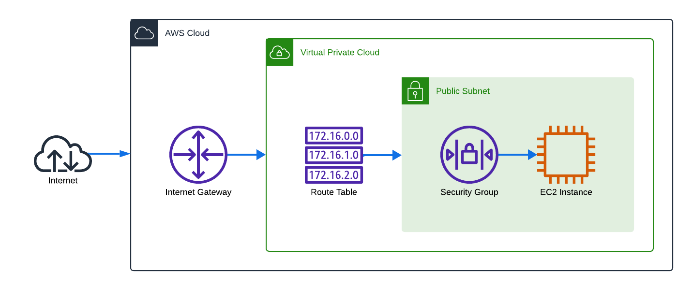
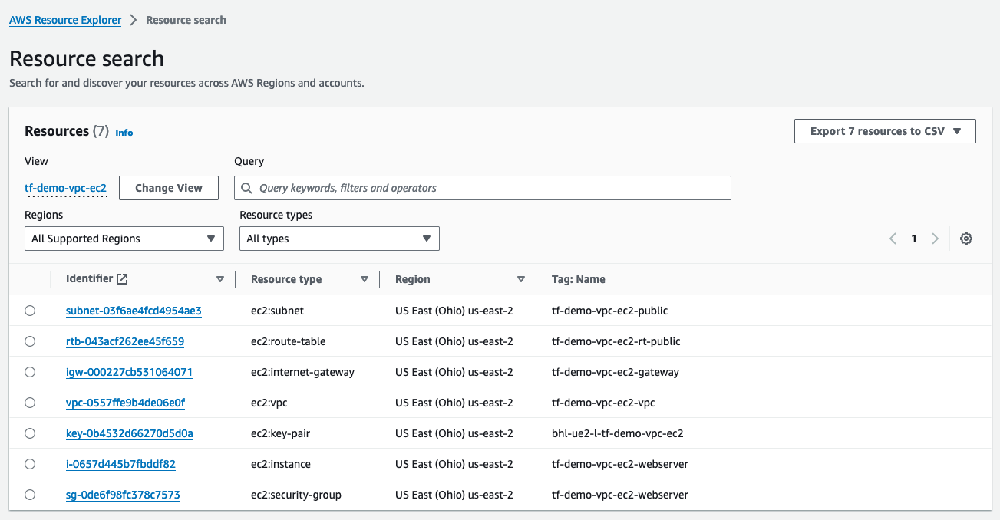

# demo.terraform-aws-vpc-ec2-public

---

This project demonstrates a Terraform project, which creates a dedicated VPC network and EC2 compute instance.

This project is intended as a basic starting point which can be easily adapted to scaffold other projects.

The following resources are created, INCLUDING the custom AWS Resource Explorer view:

### Project Goals:
- Demonstrate a one-touch infrastructure-as-code project for provisioning resources
- Demonstrate a tagging strategy
- Demonstrate reporting dashboards

### Engineering Goals:
- Keep it simple - Provide a default configuration which is fully functional
- Keep it adaptable - Design with modularity in mind, so components can be swapped out.

### Engineering Standards:
- Ensure project is fully self-contained
- Project has no external dependencies
- Project has flattened file structure
- Code follows Terraform Style Guide:
  - https://developer.hashicorp.com/terraform/language/style

### Resources created:
- Networking to enable public hosting
  - VPC
  - Public Subnet
  - Internet Gateway
  - Route Table
- Compute instance with basic Nginx "Hello World" webserver.
  - EC2
    - with "userdata" startup script
  - Security Group with ingress rules
- Resource Explorer view for quickly locating all related resources.

### Usage:
- Preconditions:
  - AWS account
  - AWS environment variables are set up in terminal
    - `AWS_ACCESS_KEY_ID`
    - `AWS_SECRET_ACCESS_KEY` 
    - `AWS_SESSION_TOKEN`
  - Terraform installed locally

### Execution:
  - `cd terraform`
  - `terraform plan`
  - `terraform apply`
  - `terraform destroy`

### Customization:
- `terraform/default.auto.tfvars` - quickly modify project settings.
- `terraform/id_ssh.pub` - replace this with YOUR ssh public key
- `terraform/userdata.txt` - customize the EC2 first-launch script